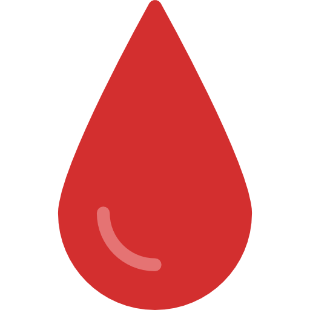

<div align="center">

<h1>BAUET Blood Donation Community</h1>
<p><strong>Find donors faster. Coordinate better. Help save lives.</strong></p>
<p>A community-powered blood donation network built for BAUET.</p>
<p>
<a href="https://blood-donation-community.vercel.app/"><strong>Open Live App</strong></a>
&nbsp;&nbsp;|&nbsp;&nbsp;
<a href="https://blood-donation-community.vercel.app/"><strong>Install App</strong></a>
&nbsp;&nbsp;|&nbsp;&nbsp;
<a href="https://github.com/mueidshahriar/Blood-Donation-Community"><strong>Source Code</strong></a>
</p>
<p>


</p>
</div>

<br />

A professional blood donation management platform built to help the BAUET community coordinate donor discovery, streamline event management, and improve emergency response through a modern web experience.

> Every donor connection can become someone else's second chance.

## Explore the Project

| | Section |
| --- | --- |
| 01 | [What it does](#highlights) |
| 02 | [Technology](#technology-stack) |
| 03 | [Install the app](#install-the-app) |
| 04 | [Run locally](#local-development-setup) |

[Live Demo](https://blood-donation-community.vercel.app)

## Quick Links

| Resource | Link |
| --- | --- |
| Live application | [blood-donation-community.vercel.app](https://blood-donation-community.vercel.app/) |
| Install the PWA | [Install BAUET BDC](https://blood-donation-community.vercel.app/) |
| Project source | [github.com/mueidshahriar/Blood-Donation-Community](https://github.com/mueidshahriar/Blood-Donation-Community) |

## Install the App

BAUET BDC is an installable Progressive Web App. Use the link below to open the live application:

**[Install BAUET BDC](https://blood-donation-community.vercel.app/)**

After opening the link:

- **Android / Chrome:** open the browser menu and choose **Install app** or **Add to Home screen**.
- **Desktop Chrome or Edge:** select the install icon in the address bar, then confirm.
- **iPhone / iPad:** use **Share -> Add to Home Screen** in Safari.

The installed app opens in a standalone window and uses the included web manifest and service worker for the PWA experience.

## Introduction

BAUET Blood Donation Community is a community-centered web application that connects voluntary blood donors with people in urgent need. The platform combines a responsive frontend, realtime Firebase data, and an AI-assisted support experience to make donor registration, donor search, event coordination, and community operations more reliable and efficient.

The project is designed for both public users and administrators. Public users can register, maintain profiles, search for eligible donors, explore upcoming events, and access donation guidance. Administrators can oversee members, log recent donations, manage events, review feedback, and monitor community activity through a centralized dashboard.

## Highlights

- Responsive homepage with live donation activity, analytics, leaderboard, and community statistics
- Donor registration and authentication with profile management
- Blood group and location-based donor search
- Donation eligibility awareness based on last donation date
- Admin dashboard for events, members, donations, and feedback
- Realtime charts for donor demographics and donation trends
- Visitor tracking and online presence monitoring
- Bilingual experience with English and Bangla support
- Progressive Web App support for installable usage
- AI assistant for donation guidance and website help
- Certificate and donor card generation

<table>
<tr>
<td width="33%" align="center"><strong>Find Donors</strong><br />Search by blood group, location, and eligibility.</td>
<td width="33%" align="center"><strong>Manage Operations</strong><br />Coordinate members, events, donations, and feedback.</td>
<td width="33%" align="center"><strong>Stay Connected</strong><br />Use the installable PWA on desktop or mobile.</td>
</tr>
</table>

## Technology Stack

| Layer | Technology |
| --- | --- |
| Frontend | HTML5, Tailwind CSS via CDN, Bootstrap utilities, vanilla JavaScript |
| Realtime Services | Firebase Realtime Database, Firebase Authentication |
| Data Visualization | Chart.js |
| AI Assistant Server | Node.js, Express, Google Generative AI SDK |
| Deployment | Static hosting for frontend, Node-compatible hosting for server |

## Architecture Overview

The application is structured as a mostly static frontend with modular JavaScript, supported by Firebase for authentication and realtime data storage. A lightweight Node.js server powers the AI assistant endpoint used by the chat experience.

Core responsibilities are divided as follows:

- `index.html` and the `pages/` directory provide the user-facing screens
- `assets/css/` contains page-specific and shared styling
- `assets/js/` contains application logic, shared modules, and page controllers
- Firebase stores donors, events, recent donations, feedback, and visitor data
- `server.js` handles chat requests for the AI assistant

## Project Structure

```text
Blood-Donation-Community/
├── index.html
├── server.js
├── package.json
├── manifest.webmanifest
├── service-worker.js
├── assets/
│   ├── css/
│   └── js/
├── pages/
├── image/
├── firebase-rules/
└── README.md
```

## Key Pages

| Page | Purpose |
| --- | --- |
| `index.html` | Landing page with hero section, recent donation feed, charts, leaderboard, and community stats |
| `pages/join.html` | Donor registration and onboarding |
| `pages/search.html` | Public donor discovery by blood group and location |
| `pages/events.html` | Public event listing and event details |
| `pages/profile.html` | Logged-in donor profile management |
| `pages/admin.html` | Centralized admin dashboard |
| `pages/leaderboard.html` | Community donor leaderboard |
| `pages/visitor-stats.html` | Visitor analytics and presence insights |

## Core Features

### Donor Management

- Secure donor sign-up and login flow
- Editable donor profiles with blood group, contact, and location details
- Donor ID tracking
- Last donation record support for eligibility-aware experience

### Smart Search

- Search donors by blood group
- Filter donors by location
- Support for finding more suitable active donors quickly in urgent cases

### Admin Dashboard

- Manage donor records and roles
- Create, update, and remove blood donation events
- Record recent donations
- Review feedback submissions
- Access summary metrics across the platform

### Analytics and Community Visibility

- Live charts for age groups, blood group distribution, and monthly donation activity
- Homepage metrics for donors, lives helped, and events
- Donor leaderboard and recent donation visibility

### Experience Enhancements

- Bangla and English interface support
- Installable PWA experience
- Certificate generation and donor card support
- AI assistant for FAQs, donation guidance, and site navigation help

## Data Model Summary

The Firebase Realtime Database primarily stores the following top-level collections:

- `donors`
- `events`
- `recentDonations`
- `stats`
- `feedback`
- `visitorTracking`

These records support donor discovery, community reporting, homepage analytics, visitor presence, and administrative workflows.

## Local Development Setup

### Prerequisites

- Node.js and npm
- A Firebase project with Realtime Database and Email/Password Authentication enabled
- A Google Generative AI API key for the assistant

### 1. Clone the repository

```bash
git clone https://github.com/mueidshahriar/Blood-Donation-Community.git
cd Blood-Donation-Community
```

### 2. Install dependencies

```bash
npm install
```

### 3. Configure Firebase

Add your Firebase client configuration to the frontend Firebase configuration file used by the project.

Required Firebase services:

- Firebase Authentication with Email/Password
- Firebase Realtime Database

### 4. Configure environment variables

Create a `.env` file in the project root:

```env
GEMINI_API_KEY=your_api_key_here
PORT=3000
```

### 5. Start the local server

```bash
npm run dev
```

After the server starts, open the local application URL in your browser.

## AI Assistant

The AI assistant is served through `server.js` and is intended to help users with:

- Blood donation FAQs
- Eligibility guidance
- Website navigation support
- Bangla, Banglish, and English conversational responses

The assistant requires a valid `GEMINI_API_KEY` in the environment configuration.

## Deployment Notes

- The frontend can be deployed on any static hosting platform
- Firebase handles authentication and realtime application data
- The AI assistant requires a separate running Node.js server or a compatible server runtime
- If frontend and server are deployed separately, ensure the chat endpoint configuration matches the deployed backend

## Contributing

Contributions are welcome. To contribute:

1. Create a new branch for your work.
2. Implement your changes with clear, focused commits.
3. Test the affected flows before submitting.
4. Open a pull request with a concise summary of the update.

## Contact

Md. Mueid Shahriar

- Email: [mdmueidshahriar16@gmail.com](mailto:mdmueidshahriar16@gmail.com)
- GitHub: [github.com/mueidshahriar](https://github.com/mueidshahriar)
- Live Demo: [blood-donation-community.vercel.app](https://blood-donation-community.vercel.app)
